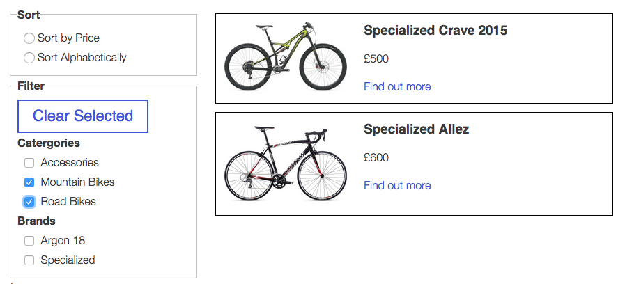

#Wordpress catalogue plugin

> PLEASE NOTE: anything in a quote block like this is functionality I'd like to add but is not currently implemented.

A simple catalogue plugin for products that (deliberately) contains no ecommerce abilities.

It's fully responsive and uses list.js to make the list sortable
> and magnifico popup for product images / light box.

Born out of a frustration that other plugins were far too complex and heavy or lacked what I conceived as basic functionality.

> Examples, screenshots and documentation all on github pages. Link.

##Basic usage

Once installed, a new panel will appear on the wordpress admin screen where products can be added.

Insert the tag [catalougue] on any page to include the catalogue page.

The rest is pretty self explanatory really.

##Customisation

> ###Search and filter
> If I was to set the list.js options as php variables, the user may be able to edit them from the wordpress admin screen?
> It would be nice if they could decide what filters and search options are available.
> #### options
> Search (default)
> Sort by price high low (default)
> Filter by category (default) - takes your custom categories.
> Sort by name alphabetical

###Styling
The plugin comes with a basic usage css file that can be used straight away.
> But there's also a folder full of Sass for customisation. More info on what sass is here. Link.
> if using your own Sass build, you should turn the defualt styles off in the settings panel
> There's 2 sass files, one for layout and one for styling. Include only the ones you require.
> ####Responsive true / false
> It's not recommended but if you're using a non responsive website you may which to set this to false.
> ####Button styles on/off
> If you already have button styling in your project, you probably want to set this to off else you'll be overriding styles a lot.
> ####Layout grid / list
> This is the main layout of the catalogue page. A choice is provided for a grid or a list layout
>####Colours - variables
> These variables can be overridden by your projects colours. Eg $catalouge-border-color: $accent-colour
> Borders
> Width....

##Refinements, edits and pull requests.

My wordpress and php knowledge are pretty much non existent and this is my first attempt at a plugin, I just wanted to share this as I found it so frustrating trying to find this functionality elsewhere. So please please please hack away and improve it, place it in a pull request. I will be very happy!
