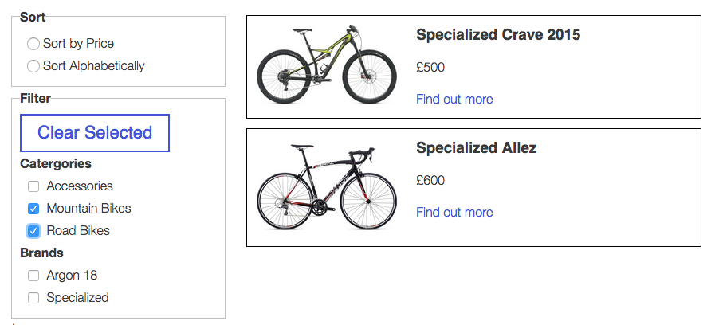

#Wordpress catalogue plugin

A simple catalogue plugin for products that (deliberately) contains no ecommerce abilities.

It's fully responsive and uses list.js to make the list sortable

Born out of a frustration that other plugins were far too complex and heavy or lacked what I conceived as basic functionality.

##Basic usage

Once installed, a new panel will appear on the wordpress admin screen where products can be added.

Insert the tag [catalogue] on any page to include the catalogue page.

The rest is pretty self explanatory really.

###Styling
The plugin comes with a basic usage css file that is included by default and can be used straight away.

But there's also a folder full of Sass for customisation - and so you dont need to include styles your not using.
If using your own Sass build, you should turn the default CSS off in the settings panel

####Responsive true / false
It's not recommended but if you're using a non responsive website you may which to set this to false.

####Button styles on/off
If you already have button styling in your project, you probably want to set this to off else you'll be overriding styles a lot.

####Layout grid / list
This is the main layout of the catalogue page. A choice is provided for a grid or a list layout

####Colours - variables
These variables can be overridden by your projects colours. Eg $catalouge-border-color: $accent-colour

## Refinements, edits and pull requests.

My wordpress and php knowledge are pretty much non existent and this is my first attempt at a plugin, I just wanted to share this as I found it so frustrating trying to find this functionality elsewhere. So please please please hack away and improve it, place it in a pull request. I will be very happy!

### Possible Future developments

* Support for multiple product images and a light box on click.
* A github pages documentation site and an example page.
* The option to selct which filter options are shown
